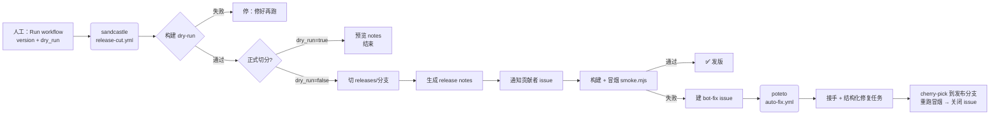

# 架构说明

## 数据流



## 与演示的映射

| 演示（Grok Bot）              | 本仓库实现                          |
| ----------------------------- | ----------------------------------- |
| sandcastle 发布经理           | `.github/workflows/release-cut.yml` |
| 私信所有贡献者                | `scripts/notify-authors.mjs`（issue @ 通知；Slack webhook 可选） |
| dry-run → 正式切分            | `dry_run` 输入参数                  |
| 自动监控构建                  | Actions 原生                        |
| 10+ agent 模糊测试群          | `scripts/smoke.mjs`（单 agent 定向冒烟；群版见 ROADMAP） |
| poteto 工程师 bot             | `.github/workflows/auto-fix.yml`    |
| @poteto 开 Cursor 项目修问题  | bot-fix issue + 结构化任务；agent 执行层见 ROADMAP |
| cherry-pick 补丁发布          | 见下                                |

## 补丁发布流程（cherry-pick）

```bash
# 1. 在 main 修好（或直接合修复 PR）
# 2. 把修复合到发布分支
git checkout releases/0.68.0
git cherry-pick <修复commit>
git push origin releases/0.68.0
# 3. 重跑冒烟：Actions → release cut → version=0.68.1 dry_run=false
```

## 设计取舍（相对演示的优化）

1. **dry-run 默认开**：演示里靠口头说 "skip dryrun"，这里做成参数，防手滑。
2. **通知可审计**：贡献者通知落成 issue 而不是只发私信，过程可追溯。
   如需真私信（Slack DM），`notify-authors.mjs` 预留了 webhook 接口。
3. **失败进队列**：冒烟失败不只停在日志里，直接建 `bot-fix` issue 进入修复队列。
4. **诚实边界**：fuzz 群和 agent 自动修是产品级工程，本仓库只做到"主链路跑通 +
   扩展点就绪"，不伪装成完整复刻。路线见 `ROADMAP.md`。
